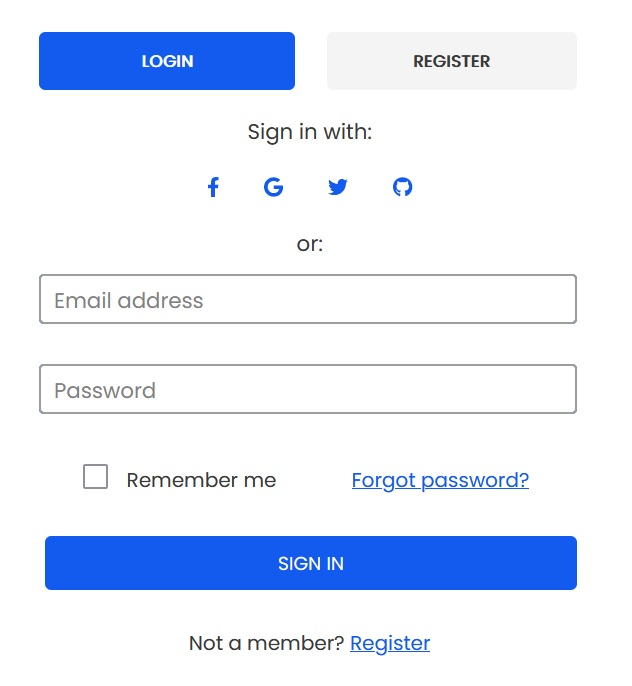
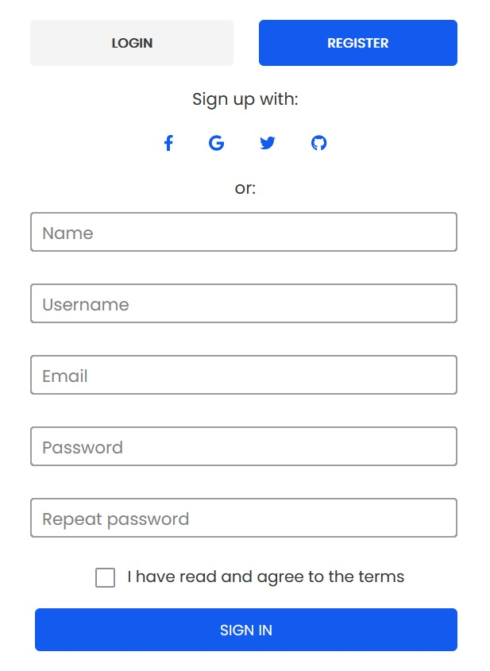
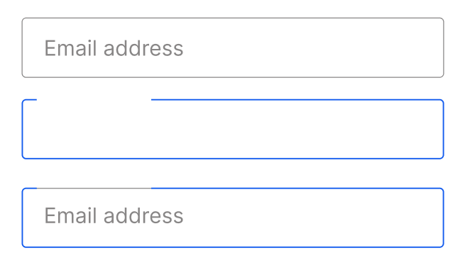
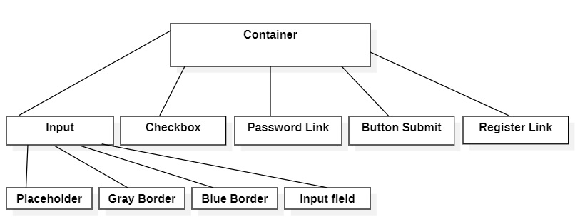

# Register page using ReactJS

In this project, I created a user-friendly page with a registration form and a login form, using a wide range of form input types and attributes.

## Built with
* HTML
* CSS
* JavaScript
* React

## Using

### Install dependencies

#### `npm install --save --legacy-peer-deps`

### Run React dev server (http://localhost:3000)

#### `npm start`

## The Final Look of the Login Form

## The Final Look of the Register Form

## The Model

## The Diagram

